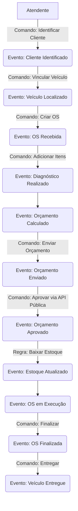
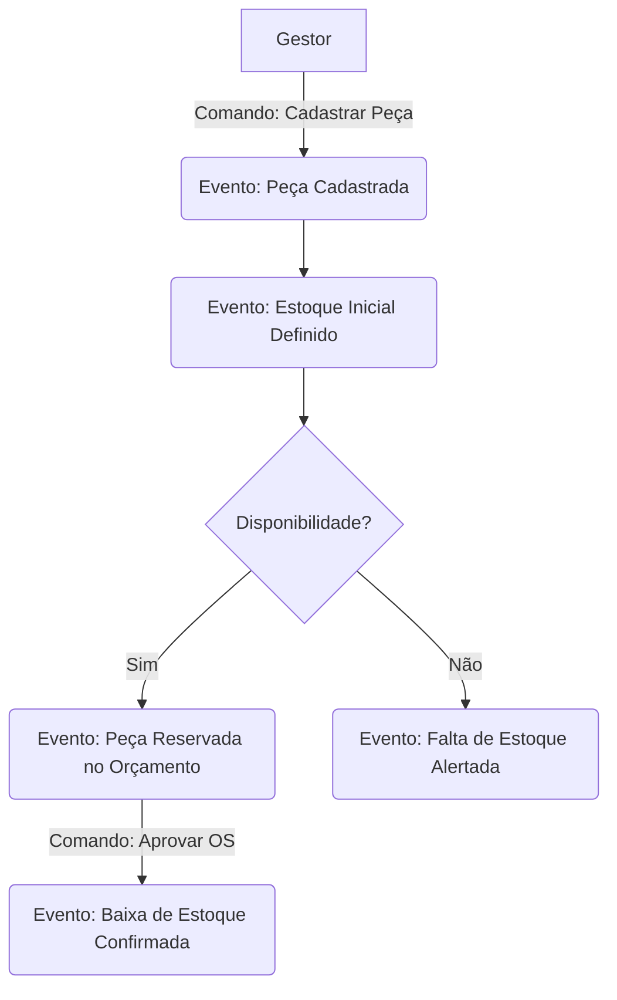
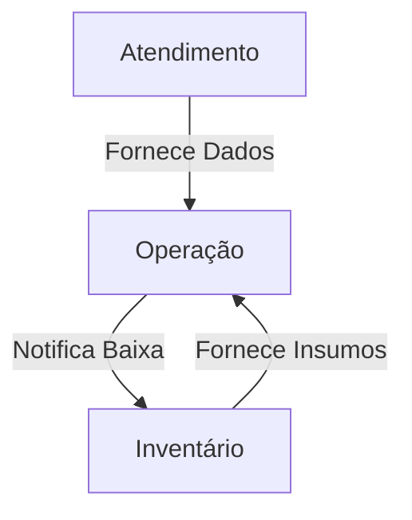
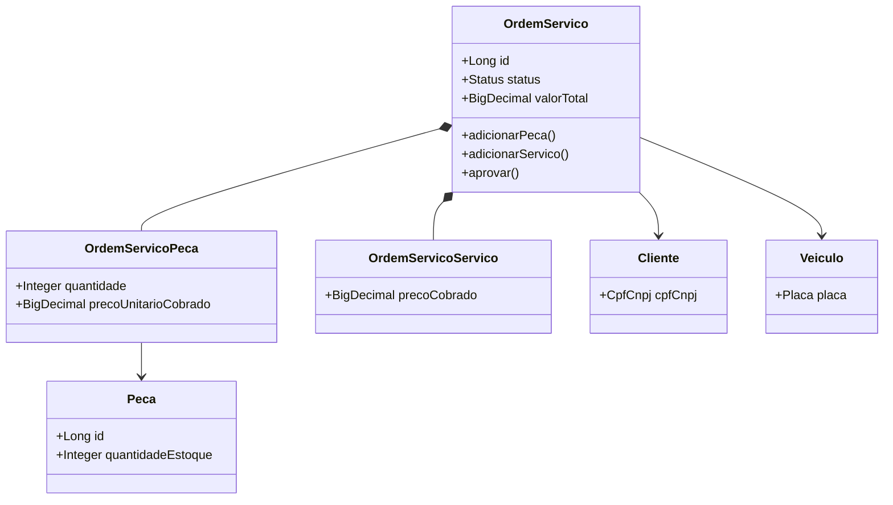

# Documentação DDD - Sistema de Gestão de Oficina

Este documento detalha a modelagem de domínio (DDD) aplicada ao projeto Oficina MVP, seguindo os requisitos técnicos da Fase 1.

## 1. Linguagem Ubíqua

Abaixo, os termos centrais do domínio utilizados tanto no código quanto na comunicação com especialistas de negócio:

| Termo | Definição | Contexto |
|-------|-----------|----------|
| **Ordem de Serviço (OS)** | Documento que centraliza o ciclo de vida da manutenção de um veículo. | Operação |
| **Cliente** | Pessoa física ou jurídica (validada por CPF/CNPJ) dona do veículo. | Atendimento |
| **Veículo** | Objeto da manutenção (identificado por Placa Mercosul/Antiga). | Atendimento |
| **Peça/Insumo** | Componente físico retirado do estoque para uso no reparo. | Inventário |
| **Serviço** | Atividade técnica de mão de obra realizada pelo mecânico. | Operação |
| **Orçamento** | Proposta financeira composta pela soma de serviços e peças. | Operação |
| **Baixa de Estoque** | Redução automática da quantidade de peças ao iniciar a execução da OS. | Inventário |

---

## 2. Event Storming (Design Estratégico)

O Event Storming mapeia a linha do tempo do negócio através de Eventos, Comandos e Atores.

### 2.1. Criação e Acompanhamento da OS

### 2.2. Gestão de Peças e Insumos

---

## 3. Mapa de Contextos (Context Map)

O sistema é dividido em Bounded Contexts lógicos para garantir alta coesão.

---

## 4. Diagrama de Agregados (Design Tático)

Este diagrama detalha a estrutura das entidades e agregados implementados no código.

---

## 5. Decisões de Modelagem
- **Entidades Ricas:** A lógica de transição de status e cálculos financeiros foi movida para a classe `OrdemServico`, evitando o antipadrão de serviços anêmicos.
- **Value Objects:** `CpfCnpj` e `Placa` garantem a integridade dos dados desde a criação, impedindo estados inválidos no sistema.
- **Baixa Automática:** A regra de baixa de estoque é disparada pelo `OrdemServicoDomainService` ao detectar a transição para `EM_EXECUCAO`, garantindo atomicidade entre o status da OS e o saldo físico.
