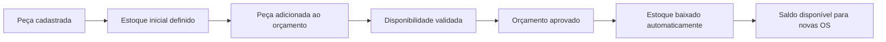
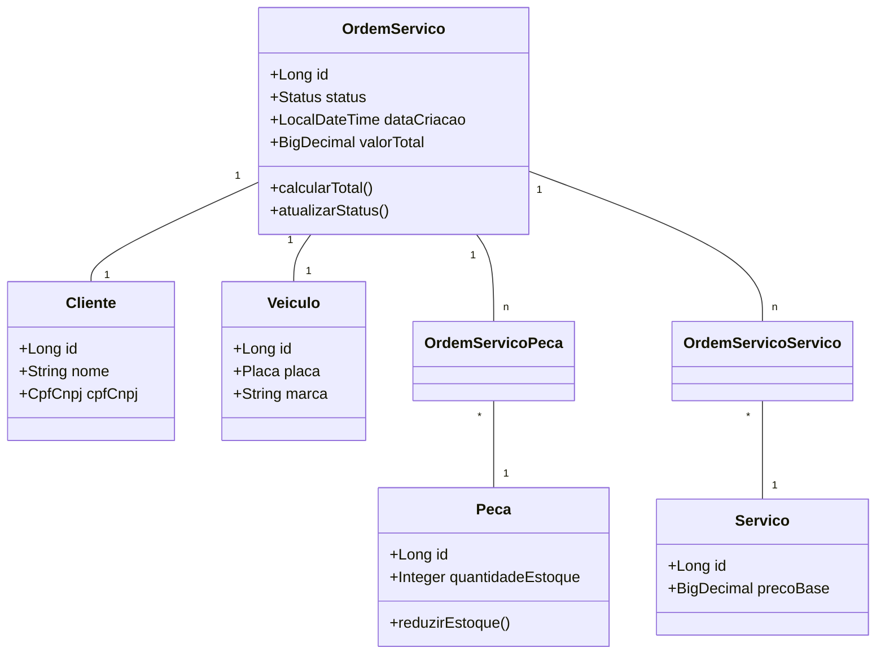

# Documentação DDD - Sistema de Gestão de Oficina

Esta documentação detalha a modelagem de domínio aplicada ao projeto, conforme exigido pelos requisitos da Fase 1.

## 1. Linguagem Ubíqua

| Termo | Definição |
|-------|-----------|
| **Ordem de Serviço (OS)** | Entidade central que gerencia o ciclo de manutenção de um veículo. |
| **Cliente** | Pessoa física ou jurídica proprietária do veículo e responsável pela aprovação do orçamento. |
| **Veículo** | Objeto da manutenção técnica. |
| **Peça/Insumo** | Componente físico utilizado no reparo, sujeito a controle de estoque. |
| **Serviço** | Atividade técnica (mão de obra) realizada por um mecânico. |
| **Orçamento** | Cálculo financeiro automático da soma de peças e serviços antes da execução. |
| **Status da OS** | Estados da OS: Recebida, Em diagnóstico, Aguardando aprovação, Em execução, Finalizada, Entregue. |

## 2. Event Storming (Criação e Acompanhamento da OS)

```mermaid
graph LR
    A[Cliente identificado por CPF/CNPJ] --> B[Veículo cadastrado ou localizado pela placa]
    B --> C[OS criada]
    C --> D[Serviços solicitados incluídos]
    D --> E[Peças e insumos incluídos]
    E --> F[Orçamento calculado automaticamente]
    F --> G[Orçamento enviado ao cliente]
    G --> H[OS aguardando aprovação]
    H --> I[Cliente aprova orçamento]
    I --> J[OS em execução]
    J --> K[OS finalizada]
    K --> L[Veículo entregue]
```

## 3. Event Storming (Gestão de Peças e Insumos)

## 4. Diagrama de Domínio (Agregados)

## 5. Contextos Delimitados
- **Contexto de Atendimento:** Gestão de Clientes, Veículos e abertura de chamados.
- **Contexto de Operação:** Execução da OS, diagnóstico e atribuição de serviços.
- **Contexto de Inventário:** Controle de estoque de peças e insumos.

## 6. Regras de Negócio Implementadas
- A OS nasce com status `RECEBIDA` e valor total zerado.
- Serviços e peças podem ser adicionados apenas em `RECEBIDA` ou `EM_DIAGNOSTICO`.
- A OS entra automaticamente em `EM_DIAGNOSTICO` quando peças ou serviços são adicionados.
- O orçamento é calculado automaticamente pela soma de serviços e peças.
- O envio do orçamento move a OS para `AGUARDANDO_APROVACAO`.
- A aprovação pública do cliente move a OS para `EM_EXECUCAO`.
- A baixa de estoque acontece ao mudar de `AGUARDANDO_APROVACAO` para `EM_EXECUCAO`.
- Transições de status inválidas são bloqueadas pelo domínio.
- CPF/CNPJ e placa são Value Objects com validação real.
- O cliente pode acompanhar suas OS pela API pública `/api/public/os?cpfCnpj=...`.
